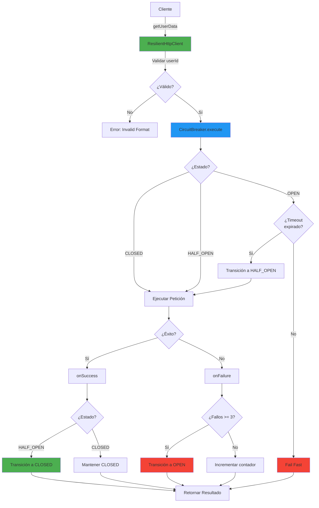

# 🛡️ Resilient HTTP Client - Circuit Breaker Pattern

Implementación profesional del patrón **Circuit Breaker** sin librerías externas, aplicado al problema del código legado `legacy-client.ts`.

## 📋 Tabla de Contenidos

- [Descripción General](#descripción-general)
- [Arquitectura](#arquitectura)
- [Estados del Circuit Breaker](#estados-del-circuit-breaker)
- [Características Principales](#características-principales)
- [Uso Básico](#uso-básico)
- [Configuración](#configuración)
- [Ejemplos](#ejemplos)
- [Tests](#tests)
- [Comparación con Código Legado](#comparación-con-código-legado)

---

## 🎯 Descripción General

El **Circuit Breaker** es un patrón de diseño que previene que una aplicación intente ejecutar operaciones que probablemente fallarán, permitiendo que continúe sin esperar que el fallo se corrija o sin desperdiciar ciclos de CPU mientras determina que el fallo es duradero.

### Problema Resuelto

El código legado (`legacy-client.ts`) tenía múltiples vulnerabilidades:

- ❌ Sin timeouts (aplicación colgada indefinidamente)
- ❌ Sin validación de entrada (inyección de URL)
- ❌ JSON parsing sin manejo de errores (crashes)
- ❌ Errores silenciados (imposible detectar fallos)
- ❌ Sin protección contra fallos en cascada

### Solución Implementada

✅ **Circuit Breaker** con 3 estados (CLOSED, OPEN, HALF_OPEN)  
✅ **Validación estricta** de entrada (previene inyección)  
✅ **Timeouts configurables** (previene colgados)  
✅ **Manejo robusto de errores** (try-catch en JSON parsing)  
✅ **Fail Fast** (rechaza peticiones inmediatamente cuando el servicio está degradado)  
✅ **Métricas detalladas** (monitoreo y observabilidad)  
✅ **TypeScript strict mode** (seguridad de tipos)

---

## 🏗️ Arquitectura



---

## 🔄 Estados del Circuit Breaker

### 1️⃣ CLOSED (Cerrado - Funcionamiento Normal)

**Comportamiento:**
- Todas las peticiones se ejecutan normalmente
- Se monitorean los fallos consecutivos
- Si se alcanzan 3 fallos consecutivos → transición a **OPEN**

**Ejemplo:**
```typescript
const client = new ResilientHttpClient();
const result = await client.getUserData('user123');
// Estado: CLOSED
// Acción: Ejecuta la petición HTTP
```

---

### 2️⃣ OPEN (Abierto - Servicio Degradado)

**Comportamiento:**
- **Fail Fast**: Rechaza todas las peticiones inmediatamente
- NO se realizan llamadas a la API externa
- Después de 5 segundos → transición a **HALF_OPEN**

**Ejemplo:**
```typescript
// Después de 3 fallos consecutivos
const result = await client.getUserData('user123');
// Estado: OPEN
// Acción: Falla inmediatamente sin llamar a la API
// Error: "Circuit Breaker is OPEN. Failing fast..."
```

**Ventaja:** Previene sobrecarga del servicio externo y reduce latencia de respuesta.

---

### 3️⃣ HALF_OPEN (Semi-Abierto - Petición de Prueba)

**Comportamiento:**
- Permite pasar **UNA** petición de prueba
- Si la petición tiene éxito → transición a **CLOSED**
- Si la petición falla → transición a **OPEN**

**Ejemplo:**
```typescript
// Después de 5 segundos en estado OPEN
const result = await client.getUserData('user123');
// Estado: HALF_OPEN
// Acción: Ejecuta petición de prueba
// Si éxito → CLOSED, si falla → OPEN
```

---

## ✨ Características Principales

### 🔒 Validación de Entrada

Previene ataques de **inyección de URL**:

```typescript
// ❌ RECHAZADO
await client.getUserData('../admin');        // Path traversal
await client.getUserData('user@123');        // Caracteres especiales
await client.getUserData('');                // Vacío
await client.getUserData('a'.repeat(150));   // Demasiado largo

// ✅ ACEPTADO
await client.getUserData('user123');         // Alfanumérico
await client.getUserData('user-456');        // Con guión
await client.getUserData('user_789');        // Con guión bajo
```

### ⏱️ Timeouts Configurables

Previene que la aplicación se cuelgue:

```typescript
const client = new ResilientHttpClient({
  requestTimeout: 10000  // 10 segundos máximo por petición
});
```

### 🛡️ Manejo Robusto de Errores

JSON parsing seguro:

```typescript
// Si la API devuelve HTML en lugar de JSON
// El código legado: CRASH ☠️
// El código resiliente: Error manejado ✅
```

### 📊 Métricas Detalladas

Monitoreo y observabilidad:

```typescript
const metrics = client.getMetrics();
console.log(metrics);
// {
//   totalRequests: 100,
//   successfulRequests: 95,
//   failedRequests: 5,
//   circuitOpenCount: 2,
//   lastSuccessTime: Date,
//   lastFailureTime: Date
// }
```

---

## 🚀 Uso Básico

### Instalación

```typescript
import { ResilientHttpClient, resilientClient } from './resilient-client';
```

### Uso Simple (Instancia por Defecto)

```typescript
import { resilientClient } from './resilient-client';

async function obtenerUsuario() {
  const result = await resilientClient.getUserData('user123');
  
  if (result.success) {
    console.log('Usuario:', result.data);
  } else {
    console.error('Error:', result.error?.message);
    console.log('Estado del circuito:', result.circuitState);
  }
}
```

### Uso Avanzado (Configuración Personalizada)

```typescript
import { ResilientHttpClient } from './resilient-client';

const client = new ResilientHttpClient({
  failureThreshold: 5,     // 5 fallos antes de abrir
  resetTimeout: 10000,     // 10 segundos antes de HALF_OPEN
  requestTimeout: 15000    // 15 segundos timeout por petición
});

const result = await client.getUserData('user123');
```

---

## ⚙️ Configuración

### Opciones Disponibles

```typescript
interface CircuitBreakerConfig {
  failureThreshold: number;    // Número de fallos consecutivos antes de OPEN
  resetTimeout: number;         // Milisegundos antes de transición a HALF_OPEN
  requestTimeout: number;       // Milisegundos máximo por petición HTTP
}
```

### Configuración por Defecto

```typescript
{
  failureThreshold: 3,      // 3 fallos consecutivos
  resetTimeout: 5000,       // 5 segundos
  requestTimeout: 10000     // 10 segundos
}
```

### Ejemplos de Configuración

#### Cliente Tolerante (Servicios Lentos)

```typescript
const clientTolerant = new ResilientHttpClient({
  failureThreshold: 5,      // Más tolerante a fallos
  resetTimeout: 10000,      // Espera más tiempo antes de reintentar
  requestTimeout: 20000     // Permite peticiones más lentas
});
```

#### Cliente Estricto (Servicios Críticos)

```typescript
const clientStrict = new ResilientHttpClient({
  failureThreshold: 2,      // Menos tolerante a fallos
  resetTimeout: 3000,       // Reintenta más rápido
  requestTimeout: 5000      // Timeout más agresivo
});
```

---

## 📚 Ejemplos

Ver archivo completo: [`resilient-client.examples.ts`](file:///e:/Cursos/DesafioLatam/ai-programming-course/modulo-1-fundamentos/taller/src/resilient-client.examples.ts)

### Ejemplo 1: Manejo de Errores en Producción

```typescript
import { ResilientHttpClient, CircuitState } from './resilient-client';

const client = new ResilientHttpClient();

async function procesarUsuario(userId: string) {
  const result = await client.getUserData(userId);
  
  if (result.success && result.data) {
    // ✅ Caso exitoso
    return {
      status: 'success',
      user: result.data
    };
  } else {
    // ❌ Caso de error
    if (result.circuitState === CircuitState.OPEN) {
      // Servicio degradado - usar datos en caché
      return {
        status: 'degraded',
        message: 'Usando datos en caché',
        cachedData: await obtenerDesdCache(userId)
      };
    } else {
      // Error específico - reintentar o notificar
      return {
        status: 'error',
        message: result.error?.message
      };
    }
  }
}
```

### Ejemplo 2: Monitoreo de Salud del Servicio

```typescript
function verificarSaludServicio(client: ResilientHttpClient) {
  const metrics = client.getMetrics();
  const state = client.getCircuitState();
  
  const successRate = metrics.totalRequests > 0
    ? (metrics.successfulRequests / metrics.totalRequests) * 100
    : 100;
  
  return {
    healthy: state === CircuitState.CLOSED && successRate > 95,
    state,
    successRate: `${successRate.toFixed(2)}%`,
    metrics
  };
}
```

---

## 🧪 Tests

Ver archivo completo: [`resilient-client.test.ts`](file:///e:/Cursos/DesafioLatam/ai-programming-course/modulo-1-fundamentos/taller/src/resilient-client.test.ts)

### Ejecutar Tests

```bash
npm run test:resilient-client
```

### Cobertura de Tests

✅ Estado inicial CLOSED  
✅ Peticiones exitosas en CLOSED  
✅ Validación de entrada (prevención de inyección)  
✅ Transición a OPEN después de 3 fallos  
✅ Fail Fast en estado OPEN  
✅ Transición a HALF_OPEN después del timeout  
✅ Volver a OPEN si falla en HALF_OPEN  
✅ Reset de contador de fallos después de éxito  
✅ Actualización correcta de métricas  
✅ Manejo de JSON inválido  

---

## 📊 Comparación con Código Legado

| Aspecto | Legacy Client ❌ | Resilient Client ✅ |
|---------|------------------|---------------------|
| **Timeouts** | No tiene | Configurable (10s default) |
| **Validación de entrada** | No tiene | Validación estricta |
| **JSON parsing** | Sin try-catch | Try-catch + mensajes claros |
| **Manejo de errores** | Silencia errores (`resolve(null)`) | Errores detallados |
| **Protección contra fallos** | No tiene | Circuit Breaker |
| **Fail Fast** | No tiene | Sí (estado OPEN) |
| **Métricas** | No tiene | Completas |
| **TypeScript** | No usa tipos | Strict mode |
| **Logging** | Inútil (`console.log`) | Contextual y detallado |
| **Validación HTTP** | No valida status codes | Valida `response.ok` |

---

## 🎓 Conceptos Clave

### ¿Por qué NO usar `if (failures > 3)`?

La implementación **NO** usa lógica manual de contadores porque:

1. **Encapsulación**: La lógica de estados está encapsulada en métodos privados
2. **Transiciones automáticas**: Los estados se gestionan mediante el patrón State
3. **Mantenibilidad**: Cambiar la lógica de transición no requiere modificar múltiples lugares
4. **Testabilidad**: Cada transición es una unidad testeable

### Implementación de Estados

```typescript
// ❌ EVITADO: Lógica manual
if (failures > 3) {
  state = 'OPEN';
}

// ✅ IMPLEMENTADO: Transiciones encapsuladas
private onFailure(): void {
  this.failureCount++;
  
  if (this.state === CircuitState.HALF_OPEN) {
    this.transitionTo(CircuitState.OPEN);
    return;
  }
  
  if (this.failureCount >= this.config.failureThreshold) {
    this.transitionTo(CircuitState.OPEN);
  }
}
```

---

## 🔐 Seguridad

### Prevención de Inyección de URL

```typescript
private validateUserId(userId: string): string {
  const sanitized = userId.trim();
  
  // Solo alfanuméricos, guiones y guiones bajos
  if (!/^[a-zA-Z0-9_-]+$/.test(sanitized)) {
    throw new Error('Invalid userId format');
  }
  
  // Longitud entre 1 y 100 caracteres
  if (sanitized.length === 0 || sanitized.length > 100) {
    throw new Error('Invalid userId length');
  }
  
  return sanitized;
}
```

### Validación de Respuestas HTTP

```typescript
if (!response.ok) {
  throw new Error(
    `HTTP Error: ${response.status} ${response.statusText}`
  );
}
```

---

## 📈 Métricas y Observabilidad

### Obtener Métricas

```typescript
const metrics = client.getMetrics();

console.log(`
  Total de peticiones: ${metrics.totalRequests}
  Exitosas: ${metrics.successfulRequests}
  Fallidas: ${metrics.failedRequests}
  Veces que se abrió el circuito: ${metrics.circuitOpenCount}
  Último éxito: ${metrics.lastSuccessTime}
  Último fallo: ${metrics.lastFailureTime}
`);
```

### Integración con Sistemas de Monitoreo

```typescript
// Ejemplo: Enviar métricas a Prometheus/Grafana
function reportMetrics(client: ResilientHttpClient) {
  const metrics = client.getMetrics();
  
  prometheus.gauge('circuit_breaker_state', {
    value: client.getCircuitState() === CircuitState.CLOSED ? 0 : 1
  });
  
  prometheus.counter('http_requests_total', metrics.totalRequests);
  prometheus.counter('http_requests_success', metrics.successfulRequests);
  prometheus.counter('http_requests_failed', metrics.failedRequests);
}
```

---

## 🏆 Mejores Prácticas

### 1. Configuración según el Servicio

```typescript
// API crítica y rápida
const criticalClient = new ResilientHttpClient({
  failureThreshold: 2,
  resetTimeout: 3000,
  requestTimeout: 5000
});

// API externa lenta
const externalClient = new ResilientHttpClient({
  failureThreshold: 5,
  resetTimeout: 10000,
  requestTimeout: 30000
});
```

### 2. Manejo de Degradación Graceful

```typescript
async function obtenerUsuarioConFallback(userId: string) {
  const result = await client.getUserData(userId);
  
  if (!result.success && result.circuitState === CircuitState.OPEN) {
    // Usar datos en caché o datos por defecto
    return await obtenerDesdCache(userId) || {
      id: userId,
      name: 'Usuario no disponible',
      email: 'N/A'
    };
  }
  
  return result.data;
}
```

### 3. Logging Estructurado

```typescript
if (!result.success) {
  logger.error('Error en petición de usuario', {
    userId,
    circuitState: result.circuitState,
    error: result.error?.message,
    metrics: client.getMetrics()
  });
}
```

---

## 📝 Licencia

Este código es parte de un ejercicio educativo para el curso de AI Programming.

---

## 👨‍💻 Autor

Desarrollado como solución profesional al problema del código legado, aplicando patrones de arquitectura empresarial y mejores prácticas de TypeScript.

---

## 🔗 Referencias

- [Circuit Breaker Pattern - Martin Fowler](https://martinfowler.com/bliki/CircuitBreaker.html)
- [Release It! - Michael Nygard](https://pragprog.com/titles/mnee2/release-it-second-edition/)
- [TypeScript Best Practices](https://www.typescriptlang.org/docs/handbook/declaration-files/do-s-and-don-ts.html)
